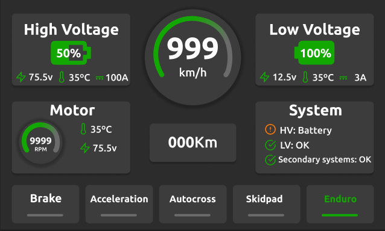
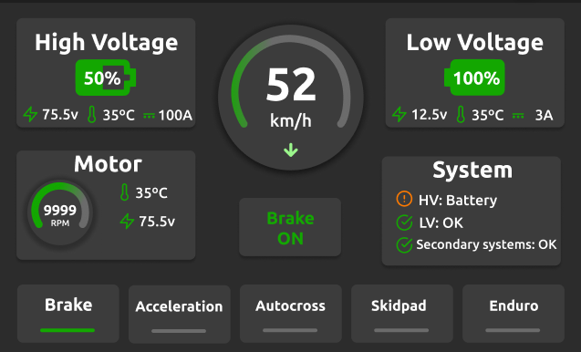
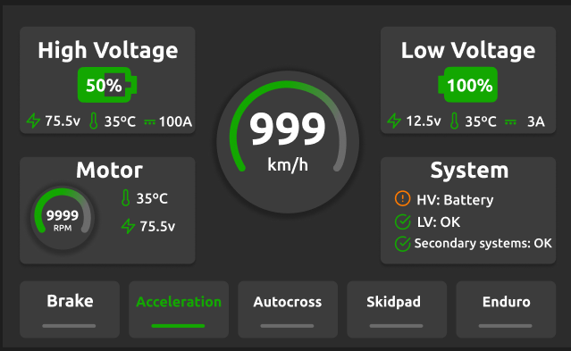
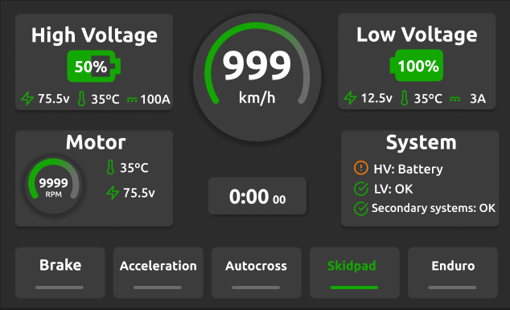
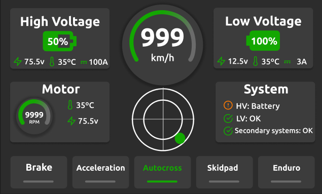

# A Importância de Ter uma Tela Dedicada para Cada Tipo de Teste no Sistema de Telemetria

Ao participar de uma competição complexa como a Fórmula SAE, cada teste exige a análise de dados específicos para garantir que o veículo atinja seu máximo desempenho em diferentes condições. Implementar uma tela dedicada para cada tipo de teste no painel de telemetria é uma prática essencial por vários motivos:

---

## 1. Endurance
O **Endurance** é um dos testes mais longos e exaustivos, focado na durabilidade e eficiência energética. Uma tela dedicada para este teste pode exibir métricas importantes como:
- Consumo de energia ao longo do tempo.
- Temperatura das baterias e motores.
- Status da carga restante da bateria.
- Velocidade média e consistência.

**Por que é importante?**  
Uma tela personalizada para o Endurance permite que a equipe monitore de perto o consumo energético e a durabilidade do sistema, prevenindo falhas e otimizando o equilíbrio entre desempenho e eficiência, aspectos cruciais para completar a prova sem esgotar a bateria.

</img>

---

## 2. Brake Test
No **Brake Test**, a eficiência e o balanceamento do sistema de frenagem são fundamentais. Uma tela exclusiva para este teste pode apresentar:
- Força de frenagem em cada roda.
- Sincronização da frenagem nas quatro rodas.
- Distância de parada.
- Desaceleração em tempo real.

**Por que é importante?**  
Com uma tela focada no Brake Test, é possível garantir que o sistema de freios está funcionando corretamente e que as quatro rodas estão travando simultaneamente, algo essencial para a segurança e controle do veículo.

</img>

---

## 3. Acceleration
O **Acceleration** mede a capacidade do carro de atingir a máxima velocidade em linha reta. Para esse teste, a tela pode mostrar:
- Tempo de aceleração (0 a 75 metros).
- Potência instantânea dos motores.
- Força de tração nas rodas.
- Desempenho do controle de tração.

**Por que é importante?**  
Durante o teste de aceleração, é essencial monitorar a entrega de potência e a tração para minimizar perdas e maximizar a performance. Uma tela dedicada ajuda a avaliar o desempenho do powertrain em detalhes, facilitando ajustes para maximizar a aceleração.

</img>

---

## 4. Skidpad
O **Skidpad** testa a aderência lateral e a estabilidade nas curvas. A tela para este teste pode incluir:
- Forças G laterais.
- Distribuição de peso durante as curvas.
- Desempenho da suspensão.
- Dados sobre a tração nas rodas ao realizar curvas.

**Por que é importante?**  
Com uma tela personalizada para o Skidpad, a equipe pode analisar em tempo real o comportamento do carro nas curvas, otimizando o equilíbrio entre aderência, estabilidade e controle da suspensão, essencial para evitar derrapagens e maximizar a eficiência nas curvas.

</img>

---

## 5. Autocross
O **Autocross** é um teste técnico que exige respostas rápidas e precisão. A tela dedicada para esse teste pode exibir:
- Tempo de volta.
- Aceleração e frenagem instantâneas.
- Desempenho da direção e controle do carro em curvas.
- Feedback de cones tocados ou erros no circuito.

**Por que é importante?**  
No Autocross, uma tela dedicada ajuda a monitorar o desempenho do carro em um ambiente técnico, com curvas fechadas e acelerações curtas. O feedback imediato sobre o tempo de volta e a manobrabilidade permite otimizar a resposta do carro e melhorar o tempo de prova.

</img>

---

## Conclusão
Ter uma tela para cada teste no sistema de telemetria facilita o foco em parâmetros específicos e críticos para cada prova. Isso garante que a equipe consiga identificar rapidamente problemas, fazer ajustes em tempo real e otimizar o desempenho do carro de maneira precisa, maximizando as chances de sucesso em cada etapa da competição.
